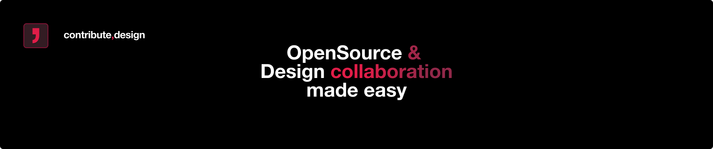

  <h1>contribute.design</h1>
   
  <a href="#">Quickstart</a>
  &nbsp;&nbsp;•&nbsp;&nbsp;
  <a href="#">Website</a>
  &nbsp;&nbsp;•&nbsp;&nbsp;
  <a href="#">Participating projects</a>
  &nbsp;&nbsp;•&nbsp;&nbsp;
  <a href="#">Best practices & Examples</a>
   
  

## 👋 Welcome and stay tuned for updates...
